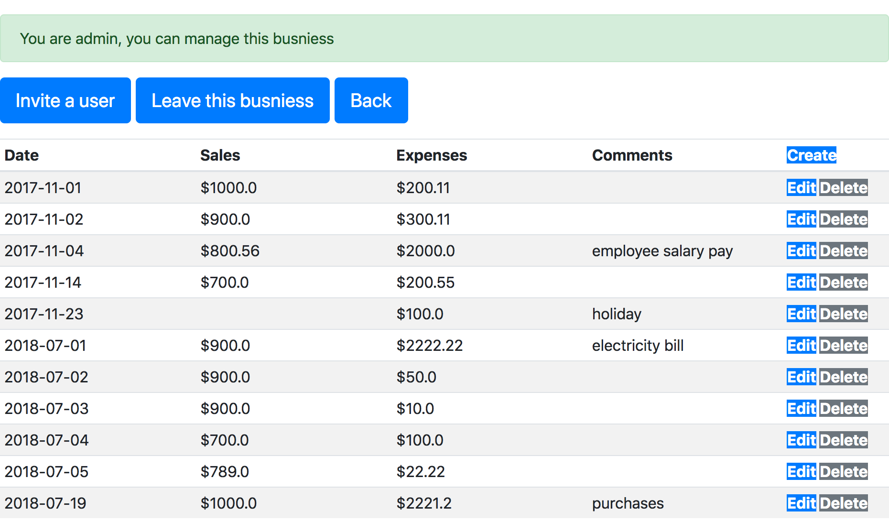
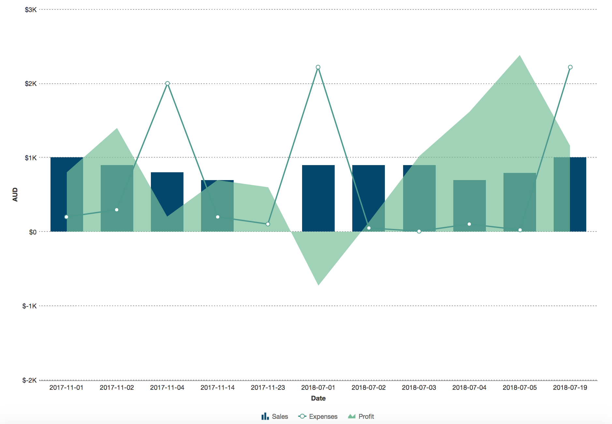

# ReportConnect App

live link: https://report-connect.herokuapp.com/

## App Main Features
- Sign in, Sign out, Sign up for every individual users
- Use chart to display dataset
- A user can invite another user to watch or admin their businesses

## Objectives
- App should have at least 3 models. Users, Admins, Businesses and more.
- Handles invalid data. Forms in your application should validate data and handle incorrect inputs.
- Validate sign up information, verify valid email addresses and secure passwords.
- Use FusionCharts Gem for displaying of data
- Heroku. Deploy your code to Heroku.

## Built With
- HTML
- CSS
- Ruby on Rails
- Bootstrap

## Built With
test account: kenny1@ga.co password: chiken  

## Screenshots

